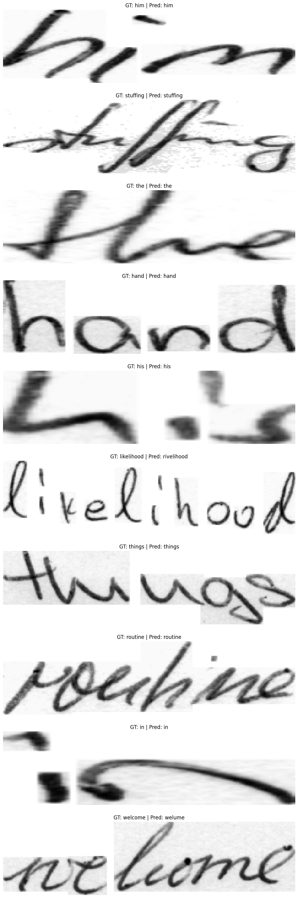
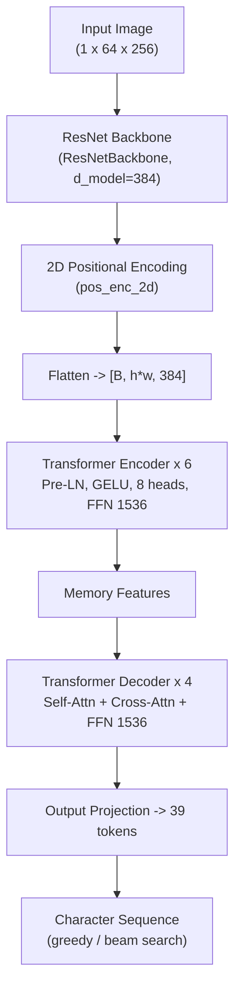
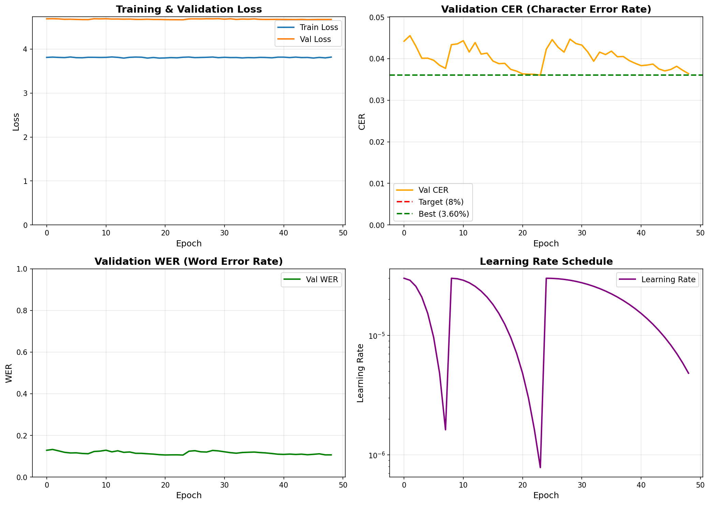

<div align="center">

# AI Handwriting Recognition

**Handwritten text recognition system built with a Transformer Encoder-Decoder (PyTorch)**

Recognizes English handwritten text, trained on the **IAM Handwriting** dataset.
Supports lowercase a-z and digits 0-9 (multi-word mode joins words with spaces), runs on both CPU and GPU.

[](https://python.org)
[](https://pytorch.org)
[](https://flask.palletsprojects.com)
[](https://opencv.org)
[](#performance)
[](#license)

<br/>

**Actual test result:**



*Web interface - draw directly on the canvas or upload an image, with step-by-step preprocessing visualization*

</div>

---

## Table of Contents

- [Features](#features)
- [Quick Start](#quick-start)
- [API](#api)
- [Model Architecture](#model-architecture)
- [Preprocessing Pipeline](#preprocessing-pipeline)
- [Performance](#performance)
- [Project Structure](#project-structure)
- [Usage Notes](#usage-notes)
- [Model Version Comparison](#model-version-comparison)
- [Troubleshooting](#troubleshooting)
- [License](#license)

## Features

| Feature | Description |
|---|---|
| **Drawing canvas** | Write directly in the browser, adjustable brush size and color |
| **Image upload** | Recognize text from existing images on your machine |
| **Single word** | Recognize one word or short phrase (lowercase a-z, digits 0-9) |
| **Multi-word / multi-line** | Line and word segmentation, per-word recognition, then text reconstruction |
| **Beam search** | Beam search decoding with length penalty and configurable beam width |
| **Spell-check** | Optional post-processing with `pyspellchecker` plus custom wordlist support |
| **Visualization** | Step-by-step preprocessing visualization of the input image |
| **Dark theme UI** | Modern dark interface |

## Quick Start

```bash
# 1. Clone
git clone <repo-url>
cd WEB_AI

# 2. Create a virtual environment
python -m venv venv
venv\Scripts\activate        # Windows

# 3. Install dependencies
pip install -r requirements.txt

# 4. Run the server
python app.py
```

Open your browser at **http://127.0.0.1:5000**

> **Note:** Model weights must exist at `models/iam_p4/best_encoder_decoder.pth` (default).
> To switch models, change `model_path` in [app.py](app.py#L41).

## API

### `POST /predict_handwriting`

<details>
<summary><b>Request</b></summary>

```json
{
  "image": "data:image/png;base64,...",
  "mode": "single",
  "decode_mode": "beam",
  "beam_width": 5,
  "spellcheck": true
}
```

| Field | Type | Default | Description |
|---|---|---|---|
| `image` | `string` | - | Base64 image (data URL, required) |
| `mode` | `string` | `"single"` | `"single"` (one word) or `"multi"` (multiple words/lines) |
| `decode_mode` | `string` | `"greedy"` | `"greedy"` or `"beam"` |
| `beam_width` | `int` | `3` | Number of candidates for beam search |
| `spellcheck` | `bool` | `false` | Enable spell correction |

</details>

<details>
<summary><b>Response - mode <code>single</code></b></summary>

```json
{
  "mode": "single",
  "text": "hello",
  "confidence": 0.95,
  "processing_steps": [
    { "name": "<step name>", "image": "data:image/png;base64,...", "shape": [64, 256] }
  ]
}
```

`processing_steps` contains one entry per preprocessing stage (grayscale, invert, CLAHE, Otsu binarization, crop, resize, pad). Step names are Vietnamese labels generated by the backend; `shape` is `[height, width]` of that intermediate image.

</details>

<details>
<summary><b>Response - mode <code>multi</code></b></summary>

```json
{
  "mode": "multi",
  "text": "hello world",
  "word_count": 2,
  "line_count": 1,
  "words": [
    {
      "text": "hello",
      "confidence": 0.95,
      "bbox": { "x": 10, "y": 20, "w": 120, "h": 40 },
      "line": 0,
      "word": 0
    }
  ],
  "segmentation_image": "data:image/png;base64,...",
  "processing_steps": [ ... ]
}
```

</details>

## Model Architecture

TrOCR-style architecture: a CNN backbone extracts image features, then a Transformer Encoder-Decoder generates text autoregressively.



| Parameter | Value |
|---|---|
| Backbone | ResNet (custom, output `[B, 384, 4, 16]`) |
| `d_model` | 384 |
| Encoder layers | 6 |
| Decoder layers | 4 |
| Attention heads | 8 |
| FFN dimension | 1536 |
| Dropout | 0.2 |
| Activation | GELU, Pre-LayerNorm |
| Vocabulary | 39 tokens (PAD, SOS, EOS + a-z + 0-9) |
| Max sequence length | 27 (inference) |
| Parameters | **27.9M trainable** (+19.2M positional-encoding buffers) |

> The model auto-detects its architecture at load time (ResNet vs SimplifiedCNN, layer counts, `d_model`) - see `load_handwriting_model()` in [handwriting_model.py](src/models/handwriting_model.py).

## Preprocessing Pipeline

```
Grayscale -> CLAHE -> Otsu Threshold -> Invert -> Crop -> Resize -> Pad (64x256)
```

1. **Grayscale** - convert the color image to grayscale
2. **CLAHE** - contrast enhancement (clipLimit=2.0, 4x4 tiles)
3. **Otsu Threshold** - automatic binarization
4. **Invert** - normalize to white background, dark text
5. **Crop** - crop the region containing the handwriting
6. **Resize** - scale while preserving aspect ratio
7. **Pad** - pad to the standard 64x256 size

## Performance

| Metric | Value |
|---|---|
| Dataset | IAM Handwriting Words Database |
| **Validation CER** | **3.60%** (best checkpoint, epoch 24) |
| Validation WER | 10.56% |
| Single-char accuracy (EMNIST test) | 87.45% (digits 97.2%, letters 78.1%) |
| Parameters | 27.9M trainable |
| Device | CPU or CUDA (auto-detected) |

<details>
<summary><b>Training curves (iam_p4)</b></summary>



</details>

## Project Structure

```
WEB_AI/
├── app.py                          # Flask server + API
├── index.html                       # Web interface
├── requirements.txt                 # Dependencies
├── docs/
│   ├── output.png                   # Actual test result screenshot
│   └── training_curves_p*.png       # Training curves (iam_p2/p3/p4)
├── models/                          # Trained model checkpoints
│   ├── iam_p1/                      # SimplifiedCNN, d=256, 4+3 layers
│   ├── iam_p2/                     # ResNet, d=384, 6+4 layers
│   ├── iam_p3/                     # ResNet, d=384, 6+4 layers
│   └── iam_p4/                     # ResNet, d=384, 6+4 layers (default)
│       └── best_encoder_decoder.pth
├── notebooks/                       # Training notebooks (Kaggle)
│   ├── train_handwriting_encdec_p*.ipynb
│   └── train_htr_mjsynth_pretrain.ipynb
├── src/
│   ├── data/
│   │   ├── handwriting_preprocessing.py   # Image preprocessing
│   │   └── segmentation.py                # Line/word segmentation
│   ├── models/
│   │   └── handwriting_model.py           # Model architecture
│   └── postprocessing/
│       └── spellcheck.py                  # Spell correction
├── static/
│   ├── main.js                      # Frontend logic
│   └── style.css                     # Styling
├── scripts/                          # Utility scripts
├── tests/                            # Unit and integration tests
├── data/                             # Datasets (gitignored)
└── legacy/digit_recognition/         # Previous MNIST digit project (TensorFlow)
```

## Usage Notes

- Write **clearly and legibly** for the best accuracy
- Uppercase letters are automatically converted to lowercase
- **Dark background with light text** works best
- **Multi** mode relies on segmentation for line/word splitting - results depend on input image quality
- Spell-check supports English only (`pyspellchecker`); a custom wordlist can be loaded from `data/wordlist.txt`

## Model Version Comparison

| | iam_p1 | iam_p2 | iam_p3 | **iam_p4 (default)** |
|---|---|---|---|---|
| Backbone | SimplifiedCNN | ResNet | ResNet | ResNet |
| `d_model` | 256 | 384 | 384 | 384 |
| Encoder/Decoder | 4 / 3 | 6 / 4 | 6 / 4 | 6 / 4 |
| Parameters | 7.3M | 27.9M | 27.9M | **27.9M** |
| val CER | 3.66% | 3.95% | 4.20% | **3.60%** |
| Best epoch | 50 | 38 | 38 | 24 |

## Troubleshooting

<details>
<summary><b>Pylance reports "Import 'spellchecker' could not be resolved"</b></summary>

Select the correct Python interpreter for your virtual environment in VS Code, then:

```bash
pip install pyspellchecker==0.7.1
```

</details>

<details>
<summary><b>NumPy 2.x conflicts with the installed PyTorch</b></summary>

```bash
pip install "numpy<2"
```

</details>

<details>
<summary><b>Model loads slowly / out of memory</b></summary>

The checkpoint is ~400MB (fp32). Make sure at least 2GB of RAM is free when loading the model.

</details>

## License

MIT License

## Acknowledgments

- [IAM Handwriting Database](https://fki.tic.heia-vs.ch/databases/iam-handwriting-database)
- [PyTorch](https://pytorch.org)
- TrOCR architecture inspiration

---

<div align="center">
Made with PyTorch
</div>
